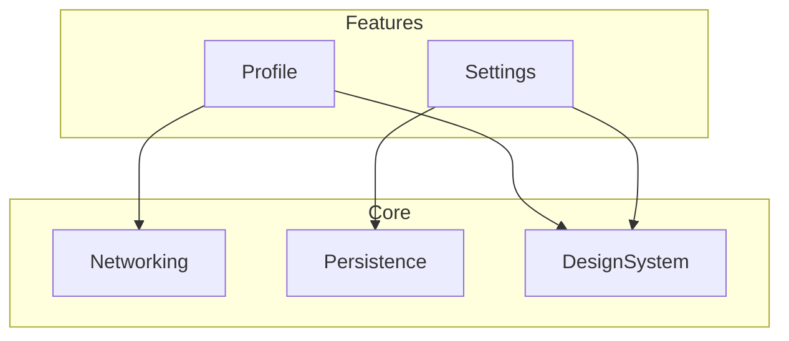

# Architecture Diagrams

Maintains one living diagram — `/docs/architecture.md` — of this app's module boundaries and data flow. For diagram-syntax mechanics and constraints, load `figma:figma-generate-diagram` if pushing the diagram into FigJam instead of/in addition to markdown; this skill covers what the diagram should contain and when to regenerate it, which stays the same regardless of render target.

## What the diagram shows

- One node per `Features/<Feature>/` module and per `Core/*` subsystem (`Networking`, `Persistence`, `DesignSystem`, `Utilities`, `Extensions`).
- Directed edges for actual dependencies: a Feature module depends on the `Core/` subsystems its ViewModels/services import, and (rarely, and worth flagging if seen) on another Feature module directly.
- No edges for things that aren't real code dependencies — don't add a "conceptual" relationship that isn't backed by an actual `import`/reference.



## Deriving edges from actual code

Don't hand-guess the dependency graph — derive it from imports/references:

```bash
grep -rl 'Core/Networking\|APIClient\|Servicing' Features/<Feature>/ 2>/dev/null
grep -rln "^import " Features/<Feature>/**/*.swift | xargs grep -h "^import"
```

A Feature-to-Feature edge (one Feature module referencing another's types directly) is architecturally unusual under this template's conventions (per `tecorb-ios-architecture` — Feature-local models aren't meant to be shared) — if grep turns one up, flag it in the diagram output as worth reviewing, don't just silently draw the edge as if it were normal.

## When to regenerate

- A new `Features/<FeatureName>/` directory is added.
- An existing Feature starts depending on a `Core/` subsystem it didn't before (e.g. adds its first SwiftData model, per `persistence-layer`).
- Explicitly asked to refresh `/docs/architecture.md`.

Regenerating means re-deriving edges from the current code (per above), not just re-rendering the same diagram with one node added — a Feature's dependencies can also shrink (e.g. a networking call removed), and the diagram should reflect that too.

## File location and format

`/docs/architecture.md` — a short intro paragraph, then the Mermaid `flowchart` block, then a one-line legend if any edge types need explaining (e.g. dashed for "planned but not yet implemented," if that convention is ever needed). Keep the diagram itself the single source of truth for module structure in `/docs` — don't duplicate the same graph as prose elsewhere.
